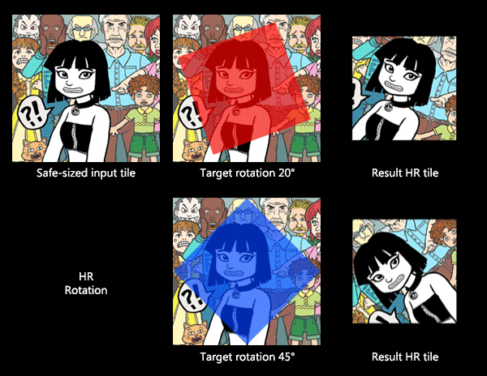
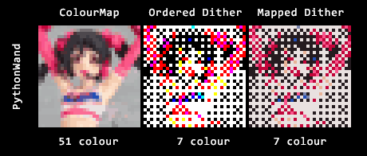

# BasicSR (Enhanced)

This is a fork of victorca25's [BasicSR](https://github.com/victorca25/BasicSR/) branch. Most of the documentation is there if you need any information regarding BasicSR. This readme will focus specifically on the differences of this fork.

## Table of Contents
1. [Dependencies](#dependencies)
3. [Features](#features)
4. [To Do](#todo)

### Dependencies

- All [BasicSR dependencies](https://github.com/victorca25/BasicSR/) as documented at victorca25's branch.
- [ImageMagick](https://imagemagick.org/script/download.php) for the image manipulation library. 
- Python package: [`pip install wand`](https://pypi.org/project/Wand/), to access IM from Python.

## Features
This features are configured in the training `.json` file.

### Load state via CPU
- Lower end graphics card with low VRAM may have difficulty resuming from a state. If you get a out of memory error when continuing a training session, then set `"load2CPU":true` so that it is loaded to the system RAM instead.

### Image transformation
- Random flipping, 90 degree rotate and HR rotate are all independent from each other, and can be applied together.

### Revamped single-image HR workflow (SISR mode)
Currently only usable with `LRHROTF` mode.
- When training with no LR data sources set, transformations are done only on the HR tile and LR tile are only generated at the last step. 
- If `hr_downscale": true` is set, large HR image are randomly downscaled before cropping to HR tile size.
- If HR image is smaller than HR tile size, then it is automatically padded to the proper size with a random colour. This is different from original branch which scales the tile up, thus potentially compromising image quality.
- If `"hr_rrot": true` is set, a different HR rotate function is used in SISR which does not scale up the result. If used in conjuction with random cropping, the image is cropped to a rotation-safe size before rotation, then cropped to the proper HR tile size.

### New LR noises
- `imdither` uses Imagemagick's dither engine to create mapped dithering. Unlike the default `dither` noise, the new image's colours are more faithful to the original image. A noticible trend when using `dither` to train models was that the colour contrast slowly declined over time, which is due to the extreme colours in the generated image being mapped to less vibrant colours.
  This approach emulates how the Fatality model's undithering training is done. As a bonus, it requires less processing than the normal dithering method.
  

- `imquantize` is basically is everything above, except for posterising the image.
- `kuwahara` uses Imagemagick's [Kuwahara filter](https://en.wikipedia.org/wiki/Kuwahara_filter) that basically removes all details from the image and only maintains the general shape. This theoratically help to train inpainting, though it is recommended to use only in short periods since normally the validation phase will act against this.

### New LR downscale types
- `123` will use Imagemagick's RGB scale, which supposedly maintains contrast when downscaling.
- `420` will use Imagemagick's liquid scale, which theoratically has no use whatsoever. However in practice, it forces the model to keep certain details while blurring out all other. Use only if one needs to get high.

## To Do list:
- Adapt SISR mode workflow to LRHR training where LR image size is identical to HR image size

## Additional Help 

If you have any questions, we have a [discord server](https://discord.gg/cpAUpDK) where you can ask them and a [Wiki](https://upscale.wiki/wiki/Main_Page) with more information.

---

## Acknowledgement
- Big thanks to *victorca25* for encouraging the creation of this fork.
- Thanks to *Twittman* for sharing how Fatality's training tiles were generated.
- Code architecture is inspired by [pytorch-cyclegan](https://u).
- Thanks to *Wai Ho Kwok*, who contributes to the initial version.

### BibTex

    @InProceedings{wang2018esrgan,
        author = {Wang, Xintao and Yu, Ke and Wu, Shixiang and Gu, Jinjin and Liu, Yihao and Dong, Chao and Qiao, Yu and Loy, Chen Change},
        title = {ESRGAN: Enhanced super-resolution generative adversarial networks},
        booktitle = {The European Conference on Computer Vision Workshops (ECCVW)},
        month = {September},
        year = {2018}
    }
    @InProceedings{wang2018sftgan,
        author = {Wang, Xintao and Yu, Ke and Dong, Chao and Loy, Chen Change},
        title = {Recovering realistic texture in image super-resolution by deep spatial feature transform},
        booktitle = {The IEEE Conference on Computer Vision and Pattern Recognition (CVPR)},
        month = {June},
        year = {2018}
    }
    @article{Hui-PPON-2019,
        title={Progressive Perception-Oriented Network for Single Image Super-Resolution},
        author={Hui, Zheng and Li, Jie and Gao, Xinbo and Wang, Xiumei},
        booktitle={arXiv:1907.10399v1},
        year={2019}
    }
    @InProceedings{Liu2019abpn,
        author = {Liu, Zhi-Song and Wang, Li-Wen and Li, Chu-Tak and Siu, Wan-Chi},
        title = {Image Super-Resolution via Attention based Back Projection Networks},
        booktitle = {IEEE International Conference on Computer Vision Workshop(ICCVW)},
        month = {October},
        year = {2019}
    }
